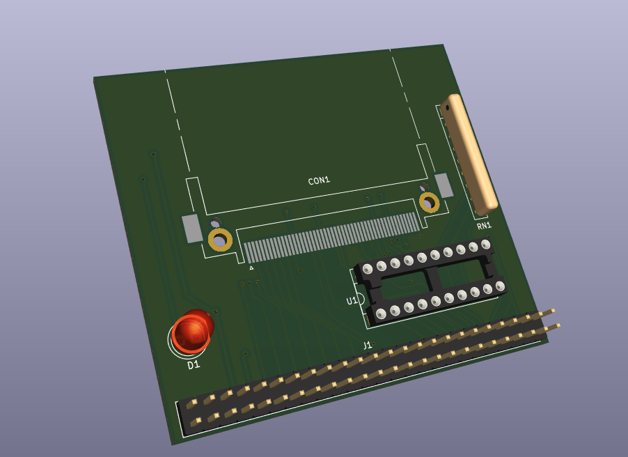

## CompactFlash adapter for Zeal 8-bit Computer

<center>
    
</center>

## This repository is part of [this Youtube video](https://youtu.be/B_ADYc3EVzc), check it for more information and explanation about this project.

The goal of this project is to create an adapter for connecting CompactFlash cards to Zeal 8-bit Computer.

This repository includes:

* An example/driver written in Z80 assembly to communicate with the adapter. It will read the first sector of the card and show the resulting bytes on the screen
* A Kicad (v6) project for the schematics and PCB board

## IMPORTANT: About the connector

As described in [the Youtube video](https://youtu.be/B_ADYc3EVzc), the CompactFlash connector needs to accept cards inserted bottom up. This is because the footprint of the connector is mirrored on the PCB.

## Requirements

To compile this example you will need:
* bash
* git (to clone this repo)
* make
* Zeal 8-bit OS source code. Only the kernel_headers directory is required, check [this repository](https://github.com/Zeal8bit/Zeal-8-bit-OS).
* z88dk v2.2 (or later). Only its assembler, z80asm, is strictly required. The latest version of z80asm must be used as earlier versions don't have support for MACRO.

To install z88dk, please check out their Github project.

## Build

To build the program, define the path to Zeal 8-bit OS, this will let us find the header files used to assemble the example:

```
export ZOS_PATH=/your/path/to/Zeal8bitOS
```

Then simply use the command:

```
make
```

After compiling, the folder `bin/` should contain the binary `readcf.bin`. This file can be then loaded to Zeal 8-bit OS through UART thanks to the `load` command.

The binary can also be embedded within the romdisk that will contain both the OS and a read-only file system. For example:

```
cd $ZOS_PATH
export EXTRA_ROMDISK_FILES="/path/to/this/repo/bin/readcf.bin"
make
```
More info about compiling Zeal 8-bit OS [here](https://github.com/Zeal8bit/Zeal-8-bit-OS#getting-started).

The resulted ROM image can then be provided to an emulator or directly flashed to the computer's ROM that will use it.

## License

Distributed under the Creative Commons Zero v1.0 Universal License. See LICENSE file for more information.

You are free to use it for personal and commercial use, the boilerplate present in each file must not be removed.

## Contact

For any suggestion or request, you can contact me at contact [at] zeal8bit [dot] com or on the Discord server https://discord.gg/UzEjwRvBBb
